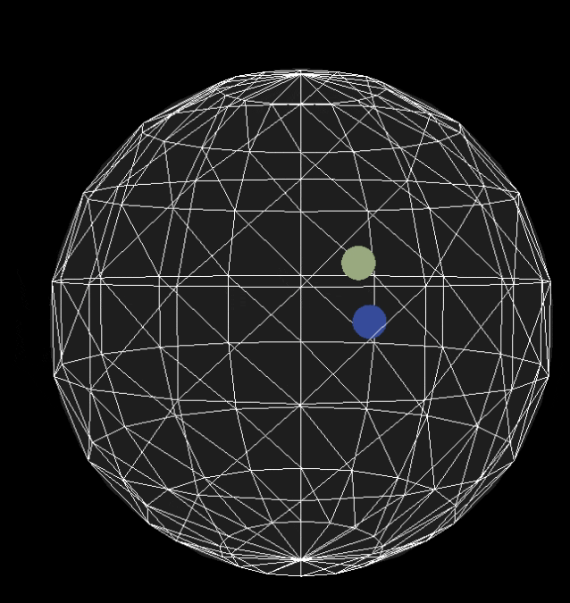
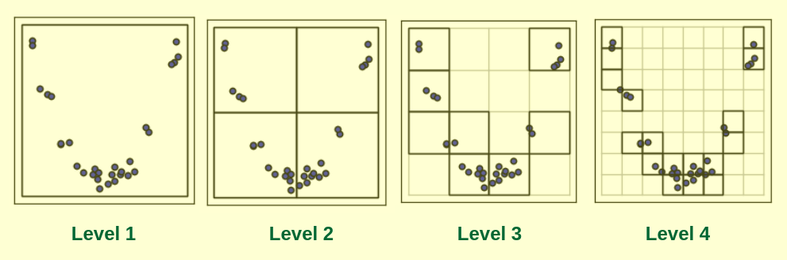
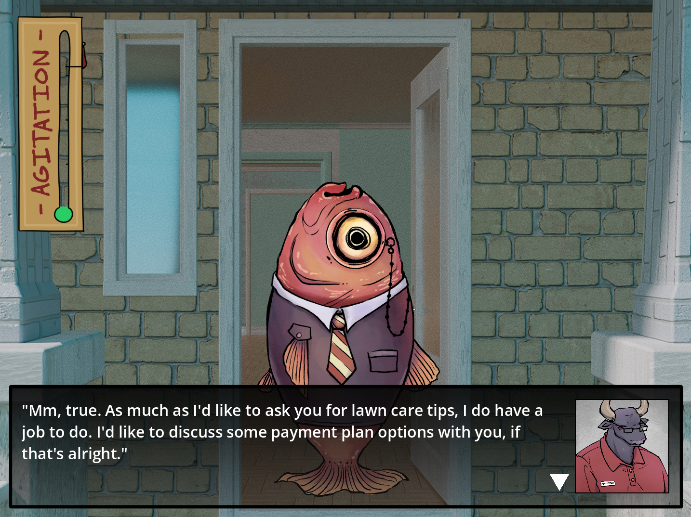

# Games Engineer Portfolio
Hi! I'm Nick. I'm currently a student studying computer science at UCLA and building a career in games. In my free time I make my own games and cool graphics projects. If you want to learn more [checkout my resume](https://github.com/0megq/0megq/blob/main/res/Resume_9_25_26.pdf) or look below for a small portfolio showcasing those projects. Enjoy!

## Jump to a specific project with the links below:
- [Particle Engine Project](#particle-engine): A 3D particle system in C++ and Raylib. Implementing custom spacial partitioning algorithms (octree, sweep and prune) for efficient collision detection
- [Godot Wild Jam #93](#godot-wild-jam93): A visual novel game built in a team of 5 with Godot. I implemented a custom dialog engine to import story text files written in Twine (a story-writing tool)
- [Trials of Yarbil](#toy): A top-down action game developed without an engine in Odin (a C-like language) and Raylib. This was a solo project where I built core engine systems like pathfinding, game serialization, level editors, and entity

<h2 id="particle-engine">Particle Engine Project</h2>

[Source Code](http://github.com/0megq/particle-engine) | C++, Raylib, CMake, 3D Physics Simulation

A C++ 3D Particle Engine built with Raylib that simulates spherical particles.

This project is my first foray into separating the __broad and narrow phase__ during collision detection. My goal is to create a performant particle engine that can simulate __thousands of spherical particles__, allowing user interaction, and later support constraints so I can implement chains and soft-bodies.

I will now explain of some of the key concepts I've used so far. What I'm about to explain does not touch on implementation specifics. For the actual __C++ codes__ and __implementation/architecture specifics__ see the [source code](https://github.com/0megq/particle-engine) and its README file (I have not written an explanation of the architecture yet).

### Euler Integration vs. Verlet Integration
Currently, particles are simulated using Verlet integration which is a method of integrating physical motion without storing velocity. Verlet integration is a more accurate method than the standard Euler integration because it uses a centered integration. Instead of using only the current frame's velocity, Verlet Integration indirectly uses the average velocity between the current and previous frame. In practice, storing the previous position instead of a velocity lets us perform Verlet integration.

Storing the previous position instead of the current velocity has additional benefits. Since Verlet integration derives the velocity from the previous and current positions, I can resolve a collision by simply moving particles into a valid spot and letting Verlet integration derive the new velocity. The bouncing of particles seen in the gif above are the result of this.

However, choosing not to store velocity comes with its own challenges. First off, forcing a particle to have a certain velocity is no longer a simple assignment (giving the particle an initial velocity is harder). Second, Verlet integration assumes the current frame time is equal to the previous frame time (I've chosen to leave out why this is exactly, as it'd make this write-up too long). This means that I must run the particle engine at a fixed framerate. This is rather simple to implement using a counter that accumulates frame time and run a particle system update once it reaches a fixed update time. Running the particle system at fixed framerate is better for general stability and theoretically allows the simulation to be deterministic.

### Octrees and Spacial Partioning
After implementing the basic particle simulation, I wanted to optimize collision checks. Previously, I was checking each particle against every other particle which results in __O(n2)__ checks every frame. The simulation could only run __~160 objects at 60fps__ and I wanted MORE! So, the optimization that made the most sense was separating collision detection into broad and narrow phases. The broad phase is the phase in which potential collision pairs are checked with a rough collision detection. The goal is to __remove pairs that are certainly not colliding.__ Then, the narrow phase which is just the basic sphere-to-sphere collision check runs on a subset of all pairs. Depending on the broad phase implementation, this can signficantly reduce the amount of checks performed. In the context of broad phase collision detection, spatial partioning provides a way to roughly check which particles are near each other without directly checking each pair. A couple methods and data structures, such as sweep and prune, and octrees exist for accomplishing this. I've chosen to start with octrees, but for in-depth explanation of several other methods see the [collision detection chapter in Real-Time Rendering](https://www.realtimerendering.com/Real-Time_Rendering_4th-Collision_Detection.pdf).

An octree is a full 8-ary tree that partitions a 3D region into a heirarchical structure. Each node in the tree stores a physical region, the particles in that region, and 0 or 8 child nodes. The child nodes of a node split the region into eight smaller equally sized volumes. When a particle is inserted into the tree it flows from the root node down to the node that completely encapsulates it (or in other implementations the leaf node that contains its center).

Source: <a href="https://www.geeksforgeeks.org/dsa/understanding-efficient-spatial-indexing/">Geeks for Geeks</a>

 

The diagram above shows the different levels of a quadtree (the 2D equivalent of an octree). Already at the second level we can see that particles in one quadrant cannot collide with particles in any other quadrant. Theoretically, if all quadrants had equal amounts of particles this would reduce the amount of checks by a factor of 4. As this explanation has gotten a little long-winded I will skip to the outcome (in-depth complexity analyses of octree's exist already). Using an Octree for broad-phase collision detection should theoretically mean that, _on average_, we only check __O(n * log(n))__ pairs with the narrow-phase sphere-to-sphere check. That's a great improvement!

However, after implementing said octree I am yet to yield any performance issues. This project is a work in progress so I am actively investigating why this is and alternative optimization methods.

### Next steps
1. Optimize further
    - Make octree collision detection actually perform better than the brute-force O(n2) check
    - Implement sweep and prune and multithread collision detection
2. Add user interaction
    - Enable/disable spawning with a button press
    - Let the user control forces on the particles such as changing the direction/strength of gravity and adding custom forces
<h2 id="godot-wild-jam93"> Godot Wild Jam #93 (Holstein Collection Inc.) </h2>

[Source Code](https://github.com/0megq/wildjam-aug26), [Demo](https://0megq.itch.io/holstein-collection-inc) | Godot, Python, Custom Dialog Engine, Team of 5

Holstein Collection Inc. is a visual novel game where you play as a bull in charge of charging at people charged with not paying their charges for charging. Needless to say the game jam's theme was "Charge".

For this project, I served as lead programmer where I wrote a __Godot dialog engine__ capable of parsing stories written natively in Twine (interactive writing tool). I worked with our writer to understand constraints and requirements. When our writer had finished writing the story in Twine importing and updating it was nearly automatic. I was actually quite proud with how well it worked. We placed __top 12 out of 183 entries__. 

I am yet to create a full technical write-up for this project, but a short [live demo](https://0megq.itch.io/holstein-collection-inc) can be played on itch. [Source code](https://github.com/0megq/wildjam-aug26) of the custom Godot dialog engine is also available.

<h2 id="toy">Trials of Yarbil</h2>

[Source Code](https://github.com/0megq/trials-of-yarbil-odin), [Demo](https://github.com/0megq/trials-of-yarbil-odin/releases/tag/v1.1), [Steam Page](https://store.steampowered.com/app/3320710/Trials_of_Yarbil/) | Odin, Raylib, Custom Engine

Trials of Yarbil is a top-down action game I released to Steam in August 2025. I developed a custom engine, alongside the game, in [Odin](https://odin-lang.org/) (a C-like language), and [Raylib](https://www.raylib.com/). This involved developing core systems that enabled the tracking, storing, and updating of entities, enemy pathfinding, character physics, enemy behavior with state machines, game serialization, tilemap rendering, level editors, and serialization of game state. The [source code's README.md](https://github.com/0megq/trials-of-yarbil-odin/blob/main/README.md) provides explanations of each of these systems along with links to the line-by-line code implementation.

### YouTube Devlogs
Throughout development I created a series of devlogs covering weekly updates and future plans for the game. During one of these devlogs I gave my viewers a __technical deep dive__ into how I save and load game data. See that video [here](https://www.youtube.com/watch?v=Mc1bU9pw7aI&t=46s).

During another devlog I showed my design and implementation process for enemy animations. See that devlog [here](https://www.youtube.com/watch?v=HNNescv4yIw).

### Game Design
Besides posting devlogs, I regularly attend a local indie dev meetup in Orange County. During the development, I presented my game a couple of times there. [This presentation](https://docs.google.com/presentation/d/1rsMVPLG6TyOSZYQy9rmooXCjFUFsv4ar0HfkUpUv9fQ/edit?usp=sharing) showcases how I went about improving and refining the level design to make it more engaging.

Lastly, during the last 3 months I worked with [Thomas Randall](https://www.youtube.com/@randyprime) who mentored me and provided guidance on how to refine the game design and visual style, as well as, iterate on player feedback. His help was tremendous especially when it came to upgrading the combat feel. The combat would not feel nearly as good without his guidance. Thanks Tom!

<!-- 
# Other Projects

[Unity and C# Sample](https://github.com/0megq/BookClubGameJam2025): This is a 3D point-and-click adventure game solo-developed in one month for the Book Club Game Jam 2025 in Unity. I worked on rigging an external

[Compute Shaders and Pixel Simulation Sample](https://github.com/0megq/cs-club-jam/tree/master): Falling sand simulation farming game. Written in Godot, it originally used GPU compute shaders, but proved too complex when integrating user interaction. The final version uses CPU simulation. -->
